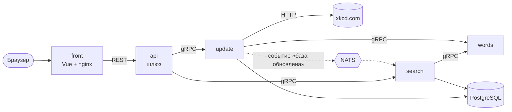

# XKCD Search

[](https://github.com/Cuga77/comix_search/actions/workflows/ci.yml)
[](search-services/go.mod)
[](search-services/proto)
[](https://nats.io)
[](LICENSE)

Поисковый сервис по комиксам [xkcd](https://xkcd.com), разбитый на микросервисы.
Пользователь вводит фразу на естественном языке и получает самые релевантные комиксы.
Проект сделан в рамках курса YADRO по backend-разработке на Go.


## Ключевые цифры

| | |
|---|---|
| **p95 = 37,6 мс** | поиск в штатном режиме (k6) |
| **p95 = 199 мс** | пиковая нагрузка 100 VU при SLA < 500 мс, без ошибок |
| **≈ 2×** | снижение p95 под пиковой нагрузкой после оптимизации запросов к PostgreSQL |
| **≈ 6×** | ускорение сбора комиксов: конкурентный краулер на worker pool против последовательного обхода |

## Архитектура



| Сервис | Что делает |
|---|---|
| **api** | REST-шлюз: JWT-авторизация для админских ручек, ограничение конкурентности на `/api/search`, rate limit на `/api/isearch` |
| **words** | Нормализация текста: токенизация, удаление стоп-слов, стемминг Snowball |
| **update** | Скачивает комиксы с xkcd.com пулом воркеров, нормализует описания через `words` и сохраняет в PostgreSQL. После обновления публикует событие в NATS |
| **search** | Два режима поиска: по базе (`Search`) и по инвертированному индексу в памяти (`ISearch`). Индекс перестраивается по событию из NATS и по таймеру |

- Контракты между сервисами описаны в [`proto/`](search-services/proto) и строго типизированы.
- Каждый сервис построен по гексагональной архитектуре: `core` содержит бизнес-логику и порты,
  `adapters` — реализации для gRPC, БД, NATS и HTTP.

## Быстрый старт

```bash
make up          # поднять все сервисы в Docker Compose
```

- Веб-интерфейс: http://localhost:28084
- API: http://localhost:28080

Чтобы наполнить базу, войди как администратор (`admin` / `password`) и нажми **Update Database**.
То же самое через API:

```bash
TOKEN=$(curl -s -X POST localhost:28080/api/login -d '{"name":"admin","password":"password"}')
curl -X POST -H "Authorization: Token $TOKEN" localhost:28080/api/db/update
curl "localhost:28080/api/search?phrase=linux+cpu&limit=5"
```

## API

| Метод | Путь | Описание |
|---|---|---|
| `GET` | `/api/search?phrase=…&limit=…` | Поиск по базе |
| `GET` | `/api/isearch?phrase=…&limit=…` | Поиск по индексу в памяти |
| `POST` | `/api/login` | Получить JWT |
| `POST` | `/api/db/update` | Обновить базу комиксов (нужен токен) |
| `DELETE` | `/api/db` | Очистить базу (нужен токен) |
| `GET` | `/api/db/stats`, `/api/db/status` | Статистика и статус обновления |
| `GET` | `/api/ping` | Проверка доступности сервисов |

## Тесты

```bash
make unit        # unit-тесты с -race и отчётом покрытия
make test        # интеграционные тесты на поднятом стеке
make load-test   # нагрузочный тест k6
make lint        # golangci-lint и protolint
```
